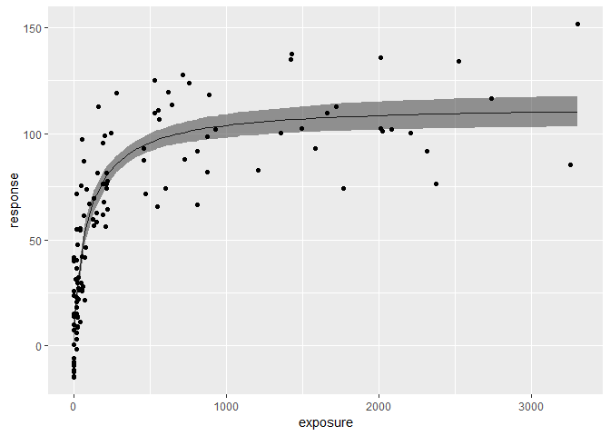

<!-- README.md is generated from README.Rmd. Please edit that file -->

# rstanemax

[](https://github.com/yoshidk6/rstanemax/actions)
[](https://cran.r-project.org/package=rstanemax)
[](https://CRAN.R-project.org/package=rstanemax)

This small package performs simple sigmoidal Emax model fit using Stan,
without the need of (1) writing Stan model code and (2) setting up an
environment to compile Stan model, inspired by **rstanarm** package.

**rstanarm** package
([link](https://mc-stan.org/users/interfaces/rstanarm)) is a very
flexible, general purpose tool to perform various Bayesian modeling with
formula notations, such as generalized mixed effect models or joint
models. One small gap it has is in nonlinear model fitting, where it
only accepts nonlinear functions defined in stats package with `SS`
prefixes
([link](http://mc-stan.org/rstanarm/articles/glmer.html#relationship-to-nlmer)).
Unfortunately the (sigmoidal) Emax model, one of the most commonly used
nonlinear functions in the field of pharmacometrics, is not among the
available functions. The **rstanarm** package also seems to be assuming
that we fit nonlinear mixed effect models, but not simple nonlinear
models without mixed effects. **brms** is another great general purpose
package that allows formula notation, but it requires users to compile
generated Stan models. The need for setting up an environment for
compiling Stan code can be daunting for beginners, especially with
Windows.

I hope this **rstanemax** package will fill the niche gap, allow for
easier implementation of Emax model in Bayesian framework, and enable
routine uses in the pharmacokinetic/pharmacodynamic field.

This package was build using **rstantools**
([link](https://mc-stan.org/rstantools/)) following a very helpful
step-by-step guide
([link](https://mc-stan.org/rstantools/articles/minimal-rstan-package.html))
on creating a package that depends on RStan.

## Installation

### From CRAN

You can install the released version of rstanemax from
[CRAN](https://CRAN.R-project.org) with:

``` r
install.packages("rstanemax")
```

### From source

You can alternatively install the package from source.  
Before doing so, you first have to install RStan and C++ Toolchain.  
[RStan Getting
Started](https://github.com/stan-dev/rstan/wiki/RStan-Getting-Started)  
Also, you have to follow the instruction below if you are using Windows
PC.  
[Installing RStan from source on
Windows](https://github.com/stan-dev/rstan/wiki/Installing-RStan-from-source-on-Windows)

After this step you should be able to install the package from GitHub
using **devtools**.

``` r
install.packages("devtools")
library(devtools)
devtools::install_github("yoshidk6/rstanemax")
```

## Example

[This GitHub pages](https://yoshidk6.github.io/rstanemax/) contains
function references and
[vignette](https://yoshidk6.github.io/rstanemax/articles/emaxmodel.html).

``` r
# Load rstanemax
library(rstanemax)
#> Loading required package: Rcpp

# Run model with a sample dataset
set.seed(12345)

data(exposure.response.sample)

fit.emax <- stan_emax(response ~ exposure, data = exposure.response.sample,
                      # the next line is only to make the output short
                      chains = 1, iter = 500, seed = 12345)
#> 
#> SAMPLING FOR MODEL 'emax' NOW (CHAIN 1).
#> Chain 1: 
#> Chain 1: Gradient evaluation took 8.1e-05 seconds
#> Chain 1: 1000 transitions using 10 leapfrog steps per transition would take 0.81 seconds.
#> Chain 1: Adjust your expectations accordingly!
#> Chain 1: 
#> Chain 1: 
#> Chain 1: Iteration:   1 / 500 [  0%]  (Warmup)
#> Chain 1: Iteration:  50 / 500 [ 10%]  (Warmup)
#> Chain 1: Iteration: 100 / 500 [ 20%]  (Warmup)
#> Chain 1: Iteration: 150 / 500 [ 30%]  (Warmup)
#> Chain 1: Iteration: 200 / 500 [ 40%]  (Warmup)
#> Chain 1: Iteration: 250 / 500 [ 50%]  (Warmup)
#> Chain 1: Iteration: 251 / 500 [ 50%]  (Sampling)
#> Chain 1: Iteration: 300 / 500 [ 60%]  (Sampling)
#> Chain 1: Iteration: 350 / 500 [ 70%]  (Sampling)
#> Chain 1: Iteration: 400 / 500 [ 80%]  (Sampling)
#> Chain 1: Iteration: 450 / 500 [ 90%]  (Sampling)
#> Chain 1: Iteration: 500 / 500 [100%]  (Sampling)
#> Chain 1: 
#> Chain 1:  Elapsed Time: 0.158951 seconds (Warm-up)
#> Chain 1:                0.065293 seconds (Sampling)
#> Chain 1:                0.224244 seconds (Total)
#> Chain 1:
#> Warning: Tail Effective Samples Size (ESS) is too low, indicating posterior variances and tail quantiles may be unreliable.
#> Running the chains for more iterations may help. See
#> http://mc-stan.org/misc/warnings.html#tail-ess
```

``` r
fit.emax
#> ---- Emax model fit with rstanemax ----
#> 
#>        mean se_mean    sd  2.5%   25%   50%   75%  97.5%  n_eff Rhat
#> emax  92.01    0.47  6.49 79.08 87.94 92.11 96.35 103.43 188.95    1
#> e0     5.69    0.35  4.92 -2.87  2.13  5.90  9.07  15.00 192.44    1
#> ec50  75.78    1.23 19.37 44.51 62.88 72.26 85.34 124.31 246.47    1
#> gamma  1.00     NaN  0.00  1.00  1.00  1.00  1.00   1.00    NaN  NaN
#> sigma 16.65    0.13  1.66 13.77 15.47 16.55 17.55  20.20 157.45    1
#> 
#> * Use `extract_stanfit()` function to extract raw stanfit object
#> * Use `extract_param()` function to extract posterior draws of key parameters
#> * Use `plot()` function to visualize model fit
#> * Use `posterior_predict()` or `posterior_predict_quantile()` function to get
#>   raw predictions or make predictions on new data
#> * Use `extract_obs_mod_frame()` function to extract raw data 
#>   in a processed format (useful for plotting)
```

``` r
plot(fit.emax)
```



## References

[Fitting the Emax Model in
R](https://www.kristianbrock.com/post/emax-intro/) has nice intro on
Emax (with kindly introducing this package). **brms** implementation of
the same model can be found [here](https://rpubs.com/mvuorre/emax-brms).
