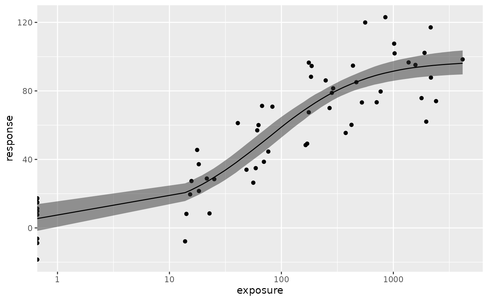
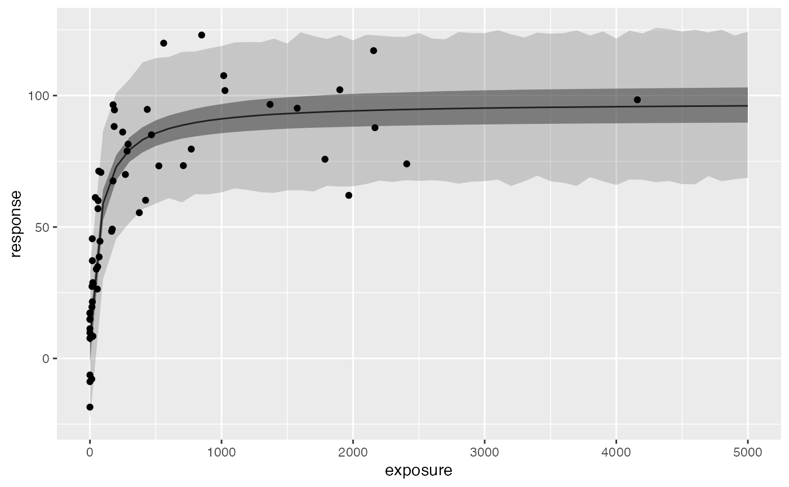
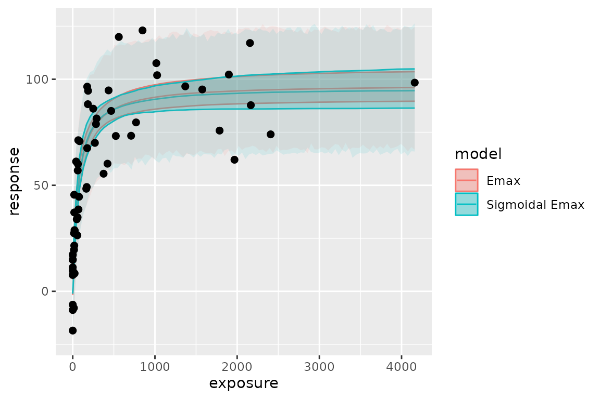
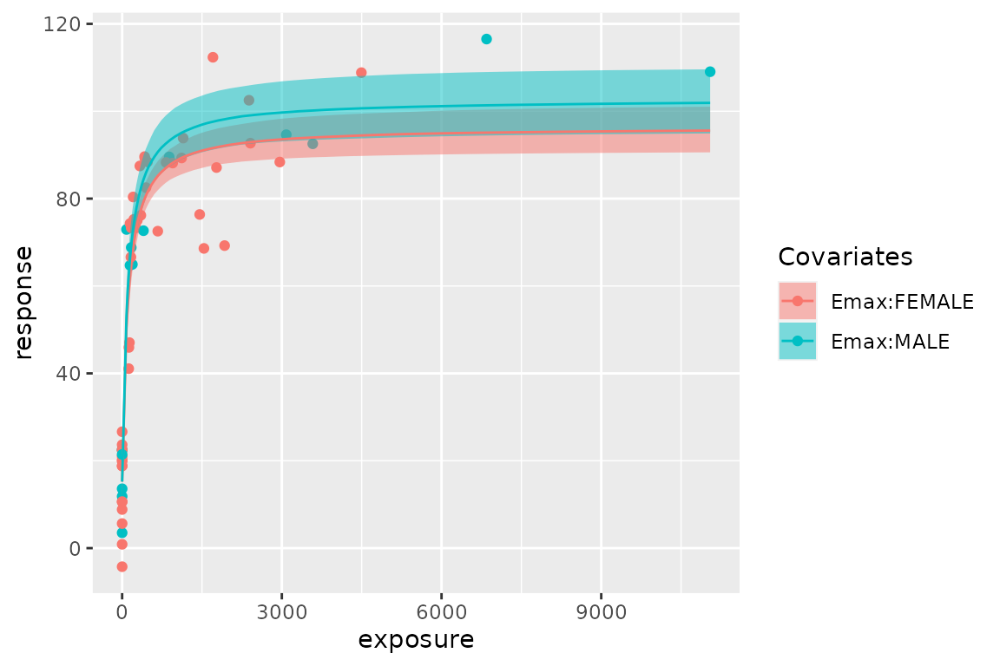
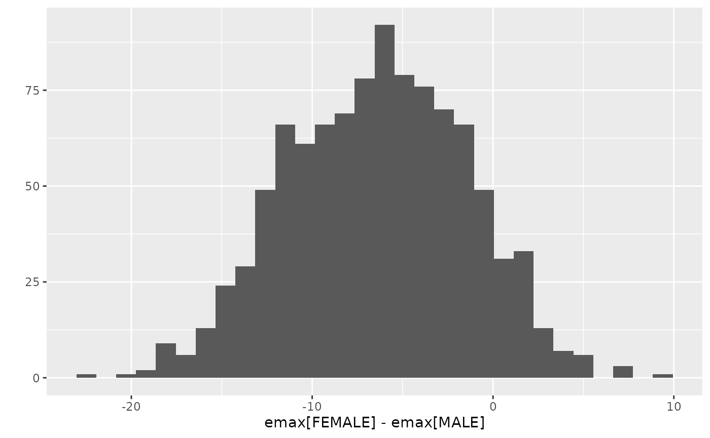

# Simple Emax model fit with Stan

``` r

library(rstanemax)
library(dplyr)
library(ggplot2)
set.seed(12345)
```

This vignette provide an overview of the workflow of Emax model analysis
using this package.

## Typical workflow

### Model run with `stan_emax` function

[`stan_emax()`](https://yoshidk6.github.io/rstanemax/reference/stan_emax.md)
is the main function of this package to perform Emax model analysis on
the data. This function requires minimum two input arguments - `formula`
and `data`. In the `formula` argument, you will specify which columns of
`data` will be used as exposure and response data, in a format similar
to [`stats::lm()`](https://rdrr.io/r/stats/lm.html) function,
e.g. `response ~ exposure`.

``` r

data(exposure.response.sample)

fit.emax <- stan_emax(response ~ exposure,
  data = exposure.response.sample,
  # the next line is only to make the example go fast enough
  chains = 2, iter = 1000, seed = 12345
)
```

``` r

fit.emax
#> ---- Emax model fit with rstanemax ----
#> 
#>        mean se_mean    sd  2.5%   25%   50%   75%  97.5%  n_eff Rhat
#> emax  92.25    0.36  6.00 80.19 88.36 92.39 96.14 103.66 280.65 1.00
#> e0     5.72    0.30  4.65 -2.89  2.63  5.47  8.51  15.49 248.72 1.00
#> ec50  75.46    0.85 19.88 45.00 61.41 72.92 87.02 118.99 545.68 1.01
#> gamma  1.00     NaN  0.00  1.00  1.00  1.00  1.00   1.00    NaN  NaN
#> sigma 16.60    0.07  1.63 13.79 15.47 16.52 17.60  20.03 585.62 1.00
#> 
#> * Use `extract_stanfit()` function to extract raw stanfit object
#> * Use `extract_param()` function to extract posterior draws of key parameters
#> * Use `plot()` function to visualize model fit
#> * Use `posterior_predict()` or `posterior_predict_quantile()` function to get
#>   raw predictions or make predictions on new data
#> * Use `extract_obs_mod_frame()` function to extract raw data 
#>   in a processed format (useful for plotting)
```

[`plot()`](https://rdrr.io/r/graphics/plot.default.html) function shows
the estimated Emax model curve with 95% credible intervals of
parameters.

``` r

plot(fit.emax)
```


Output of [`plot()`](https://rdrr.io/r/graphics/plot.default.html)
function (for `stanemax` object) is a `ggplot` object, so you can apply
additional settings as you would do in `ggplot2`.  
Here is an example of using log scale for x axis (note that exposure ==
0 is hanging at the very left, making the curve a bit weird).

``` r

plot(fit.emax) + scale_x_log10() + expand_limits(x = 1)
#> Warning in scale_x_log10(): log-10 transformation introduced infinite values.
#> log-10 transformation introduced infinite values.
#> log-10 transformation introduced infinite values.
```



Raw output from `rstan` is stored in the output variable, and you can
access it with
[`extract_stanfit()`](https://yoshidk6.github.io/rstanemax/reference/stanemax-methods.md)
function.

``` r

class(extract_stanfit(fit.emax))
#> [1] "stanfit"
#> attr(,"package")
#> [1] "rstan"
```

### Prediction of response with new exposure data

[`posterior_predict()`](https://yoshidk6.github.io/rstanemax/reference/posterior_predict.md)
function allows users to predict the response using new exposure data.
If `newdata` is not provided, the function returns the prediction on the
exposures in original data. The default output is a matrix of posterior
predictions, but you can also specify “dataframe” or “tibble” that
contain posterior predictions in a long format. See help of
[`rstanemax::posterior_predict()`](https://yoshidk6.github.io/rstanemax/reference/posterior_predict.md)
for the description of two predictions, `respHat` and `response`.

``` r

response.pred <- posterior_predict(fit.emax, newdata = c(0, 100, 1000), returnType = "tibble")
#> Warning: The `returnType` argument of `posterior_predict()` is deprecated as of
#> rstanemax 0.1.8.
#> This warning is displayed once per session.
#> Call `lifecycle::last_lifecycle_warnings()` to see where this warning was
#> generated.

response.pred %>% select(mcmcid, exposure, respHat, response)
#> # A tibble: 3,000 × 4
#>    mcmcid exposure   respHat response
#>     <int>    <dbl> <dbl[1d]>    <dbl>
#>  1      1        0     11.8      14.1
#>  2      1      100     55.4      84.5
#>  3      1     1000     88.0      80.4
#>  4      2        0     -2.84    -17.0
#>  5      2      100     61.2      57.7
#>  6      2     1000     90.8      83.3
#>  7      3        0      4.01    -10.1
#>  8      3      100     57.5      57.6
#>  9      3     1000     92.1      85.6
#> 10      4        0      6.34     42.3
#> # ℹ 2,990 more rows
```

You can also get quantiles of predictions with
[`posterior_predict_quantile()`](https://yoshidk6.github.io/rstanemax/reference/posterior_predict.md)
function.

``` r

resp.pred.quantile <- posterior_predict_quantile(fit.emax, newdata = seq(0, 5000, by = 100))
resp.pred.quantile
#> # A tibble: 51 × 11
#>    exposure covemax covec50 cove0 Covariates ci_low ci_med ci_high pi_low pi_med
#>       <dbl> <fct>   <fct>   <fct> <chr>       <dbl>  <dbl>   <dbl>  <dbl>  <dbl>
#>  1        0 1       1       1     ""          -1.71   5.47    13.9  -22.3   5.59
#>  2      100 1       1       1     ""          52.8   58.9     64.8   30.0  58.4 
#>  3      200 1       1       1     ""          68.0   73.0     77.9   45.9  73.4 
#>  4      300 1       1       1     ""          75.2   79.6     84.2   51.4  79.5 
#>  5      400 1       1       1     ""          79.0   83.4     88.1   56.9  83.7 
#>  6      500 1       1       1     ""          81.2   85.9     90.8   60.1  87.4 
#>  7      600 1       1       1     ""          82.7   87.7     92.9   60.5  88.0 
#>  8      700 1       1       1     ""          83.8   89.1     94.5   60.8  88.9 
#>  9      800 1       1       1     ""          84.6   90.1     95.7   62.9  89.4 
#> 10      900 1       1       1     ""          85.4   90.8     96.6   62.9  91.7 
#> # ℹ 41 more rows
#> # ℹ 1 more variable: pi_high <dbl>
```

Input data can be obtained in a same format with
[`extract_obs_mod_frame()`](https://yoshidk6.github.io/rstanemax/reference/stanemax-methods.md)
function.

``` r

obs.formatted <- extract_obs_mod_frame(fit.emax)
```

These are particularly useful when you want to plot the estimated Emax
curve.

``` r

ggplot(resp.pred.quantile, aes(exposure, ci_med)) +
  geom_line() +
  geom_ribbon(aes(ymin = ci_low, ymax = ci_high), alpha = .5) +
  geom_ribbon(aes(ymin = pi_low, ymax = pi_high), alpha = .2) +
  geom_point(
    data = obs.formatted,
    aes(y = response)
  ) +
  labs(y = "response")
```



Posterior draws of Emax model parameters can be extracted with
[`extract_param()`](https://yoshidk6.github.io/rstanemax/reference/extract_param.md)
function.

``` r

posterior.fit.emax <- extract_param(fit.emax)
posterior.fit.emax
#> # A tibble: 1,000 × 6
#>    mcmcid  emax    e0  ec50     gamma     sigma
#>     <int> <dbl> <dbl> <dbl> <dbl[1d]> <dbl[1d]>
#>  1      1  83.1 11.8   90.6         1      18.0
#>  2      2  98.7 -2.84  54.0         1      17.0
#>  3      3  95.0  4.01  77.4         1      13.7
#>  4      4  92.4  6.34  60.6         1      16.5
#>  5      5  91.6 10.7   65.1         1      16.5
#>  6      6 100.   4.21  72.4         1      16.2
#>  7      7  91.8  3.87  59.6         1      15.5
#>  8      8  86.2  6.69  54.2         1      20.6
#>  9      9  97.4  2.26  59.3         1      18.0
#> 10     10  85.1  8.93  54.5         1      17.5
#> # ℹ 990 more rows
```

## Fix parameter values in Emax model

You can fix parameter values in Emax model for Emax, E0 and/or gamma
(Hill coefficient). See help of
[`stan_emax()`](https://yoshidk6.github.io/rstanemax/reference/stan_emax.md)
for the details. The default is to fix gamma at 1 and to estimate Emax
and E0 from data.

Below is the example of estimating gamma from data.

``` r

data(exposure.response.sample)

fit.emax.sigmoidal <- stan_emax(response ~ exposure,
  data = exposure.response.sample,
  gamma.fix = NULL,
  # the next line is only to make the example go fast enough
  chains = 2, iter = 1000, seed = 12345
)
```

``` r

fit.emax.sigmoidal
#> ---- Emax model fit with rstanemax ----
#> 
#>        mean se_mean    sd  2.5%   25%   50%   75%  97.5%  n_eff Rhat
#> emax  90.02    0.58 10.32 73.46 83.11 88.70 95.63 114.76 317.23 1.01
#> e0     6.96    0.21  4.84 -3.04  3.74  7.06 10.15  16.46 528.43 1.01
#> ec50  78.62    1.72 30.22 44.50 59.56 71.99 88.88 153.71 308.57 1.00
#> gamma  1.16    0.02  0.34  0.62  0.93  1.12  1.34   1.93 444.96 1.01
#> sigma 16.81    0.08  1.69 13.99 15.56 16.61 17.84  20.53 467.62 1.01
#> 
#> * Use `extract_stanfit()` function to extract raw stanfit object
#> * Use `extract_param()` function to extract posterior draws of key parameters
#> * Use `plot()` function to visualize model fit
#> * Use `posterior_predict()` or `posterior_predict_quantile()` function to get
#>   raw predictions or make predictions on new data
#> * Use `extract_obs_mod_frame()` function to extract raw data 
#>   in a processed format (useful for plotting)
```

You can compare the difference of posterior predictions between two
models (in this case they are very close to each other):

``` r

exposure_pred <- seq(min(exposure.response.sample$exposure),
  max(exposure.response.sample$exposure),
  length.out = 100
)

pred1 <-
  posterior_predict_quantile(fit.emax, exposure_pred) %>%
  mutate(model = "Emax")
pred2 <-
  posterior_predict_quantile(fit.emax.sigmoidal, exposure_pred) %>%
  mutate(model = "Sigmoidal Emax")

pred <- bind_rows(pred1, pred2)


ggplot(pred, aes(exposure, ci_med, color = model, fill = model)) +
  geom_line() +
  geom_ribbon(aes(ymin = ci_low, ymax = ci_high), alpha = .3) +
  geom_ribbon(aes(ymin = pi_low, ymax = pi_high), alpha = .1, color = NA) +
  geom_point(
    data = exposure.response.sample, aes(exposure, response),
    color = "black", fill = NA, size = 2
  ) +
  labs(y = "response")
```



## Set covariates

You can specify categorical covariates for Emax, EC50, and E0. See help
of
[`stan_emax()`](https://yoshidk6.github.io/rstanemax/reference/stan_emax.md)
for the details.

``` r

data(exposure.response.sample.with.cov)

test.data <-
  mutate(exposure.response.sample.with.cov,
    SEX = ifelse(cov2 == "B0", "MALE", "FEMALE")
  )

fit.cov <- stan_emax(
  formula = resp ~ conc, data = test.data,
  param.cov = list(emax = "SEX"),
  # the next line is only to make the example go fast enough
  chains = 2, iter = 1000, seed = 12345
)
```

``` r

fit.cov
#> ---- Emax model fit with rstanemax ----
#> 
#>                mean se_mean    sd  2.5%   25%    50%    75%  97.5%  n_eff Rhat
#> emax[FEMALE]  81.26    0.16  3.81 73.53 78.70  81.14  83.70  88.79 552.80 1.01
#> emax[MALE]    87.64    0.20  5.19 77.54 84.15  87.63  91.21  98.17 667.62 1.01
#> e0            15.20    0.09  2.30 10.40 13.72  15.22  16.69  19.66 705.42 1.01
#> ec50         107.65    0.78 21.27 67.63 93.17 106.98 121.07 151.35 742.54 1.00
#> gamma          1.00     NaN  0.00  1.00  1.00   1.00   1.00   1.00    NaN  NaN
#> sigma         10.51    0.03  1.00  8.84  9.77  10.44  11.15  12.70 871.21 1.00
#> 
#> * Use `extract_stanfit()` function to extract raw stanfit object
#> * Use `extract_param()` function to extract posterior draws of key parameters
#> * Use `plot()` function to visualize model fit
#> * Use `posterior_predict()` or `posterior_predict_quantile()` function to get
#>   raw predictions or make predictions on new data
#> * Use `extract_obs_mod_frame()` function to extract raw data 
#>   in a processed format (useful for plotting)
plot(fit.cov)
```



You can extract MCMC samples from raw stanfit and evaluate differences
between groups.

``` r

fit.cov.posterior <-
  extract_param(fit.cov)

emax.posterior <-
  fit.cov.posterior %>%
  select(mcmcid, SEX, emax) %>%
  tidyr::pivot_wider(names_from = SEX, values_from = emax) %>%
  mutate(delta = FEMALE - MALE)

ggplot2::qplot(delta, data = emax.posterior, bins = 30) +
  ggplot2::labs(x = "emax[FEMALE] - emax[MALE]")
#> Warning: `qplot()` was deprecated in ggplot2 3.4.0.
#> This warning is displayed once per session.
#> Call `lifecycle::last_lifecycle_warnings()` to see where this warning was
#> generated.

# Credible interval of delta
quantile(emax.posterior$delta, probs = c(0.025, 0.05, 0.5, 0.95, 0.975))
#>       2.5%         5%        50%        95%      97.5% 
#> -16.117172 -14.467374  -6.249869   1.593632   2.551678

# Posterior probability of emax[FEMALE] < emax[MALE]
sum(emax.posterior$delta < 0) / nrow(emax.posterior)
#> [1] 0.903
```


